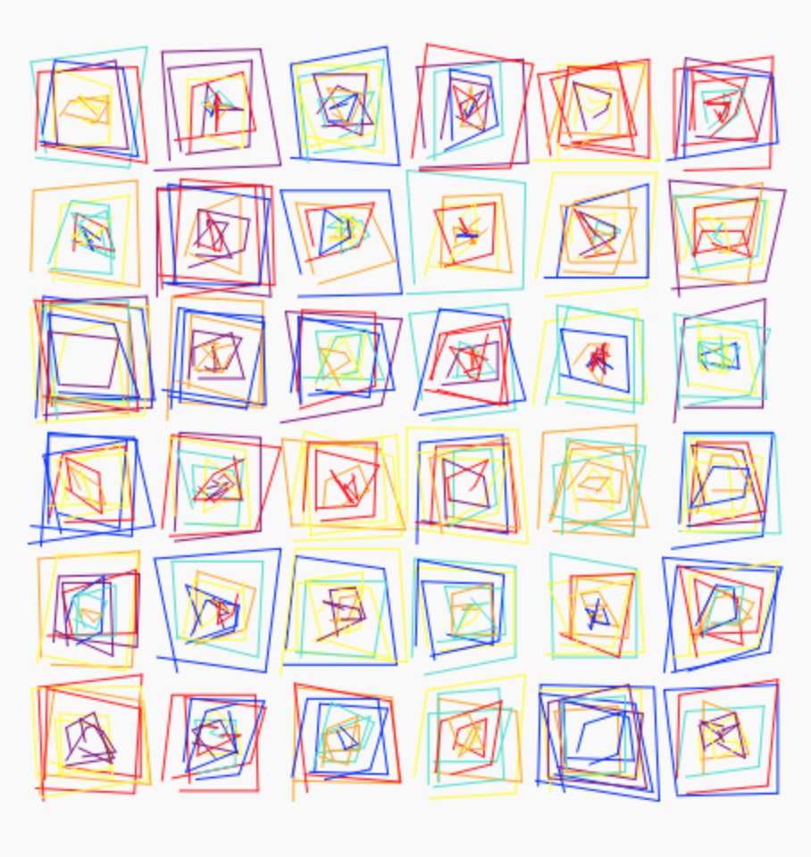

## Part of the poetic computation awesomeness 🫀👾 🟨 🟪 on artist Vera Molnar 

### Generative or Algorithmic Art goes back to the very earliest days of computer graphics and some of the key pioneers of this movement produced work before computer screens were even a thing. It was necessary for them to come up with a clear logic, program an algorithm, and hope for the best when the plotter spit out the results. Some of these earliest pioneers continue as a source of inspiration to algorithmic art to this day, and their early experiments continue to be useful for those learning to code or design algorithms to this day.

### One of these early pioneers is the French-Hungarian artist Vera Molnár. She and other generative artists took important ideas from abstract art and Minimalism, which also flourished in the 1960s when many early experiments were done. For more, her biography on Wikipedia: https://en.wikipedia.org/wiki/Vera_Molnár

 

